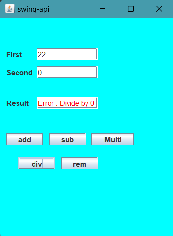

# Java Swing Calculator

A simple **Calculator application** built using **Java Swing**. This calculator performs basic arithmetic operations including addition, subtraction, multiplication, division, and remainder (modulus).

## Features

- Add, Subtract, Multiply, Divide, and Remainder operations
- Error handling for division and modulus by zero
- Graphical User Interface built with Java Swing
- Colored background for better UI experience

## Screenshots

  <!-- optional, add a screenshot of your app -->

## How to Run

1. Make sure you have **Java JDK** installed.
2. Clone the repository:
   ```bash
   git clone https://github.com/your-username/Java-Swing-Calculator.git
